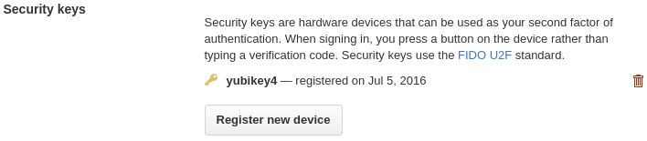
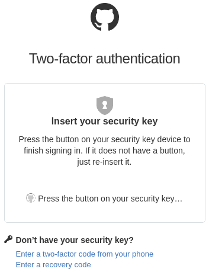

!SLIDE
# FIDO U2F
## Pre-setup
* Mostly just plug it in
* May get a prompt for the new device on Mac/Win
* May need to add udev rules on Linux
* Short USB extension or strain relief may be useful

!SLIDE
# FIDO U2F
## Registering a U2F Token
* Open the "Security" settings page and click "Edit" under "Two-factor
  authentication"
* "Security keys" section at bottom has a button to add a device
* Prompts you to name the device
* Prompts you to press the button

!SLIDE
# FIDO U2F

## Login with a U2F Token
* Enter login and password
* Plug it in and press the button when prompted
* If you don't have it on you, you can still use TOTP, SMS, or backup code

~~~SECTION:notes~~~

If you want to use SMS you have to click phone first, then it will default to
TOTP and you click again for SMS.

~~~ENDSECTION~~~

!SLIDE
# FIDO U2F
## Where to get one?
* Yubikey 4 is a multifunction USB device
    * FIDO U2F, OpenPGP SmartCard emulation, static password
    * <http://www.yubico.com/> or [Amazon](http://www.amazon.com/)
* Cheaper U2F-only keys on Amazon (search for "U2F")
    * $10 model with a physical button
    * $6 model doesn't even have a button, activates on insert

